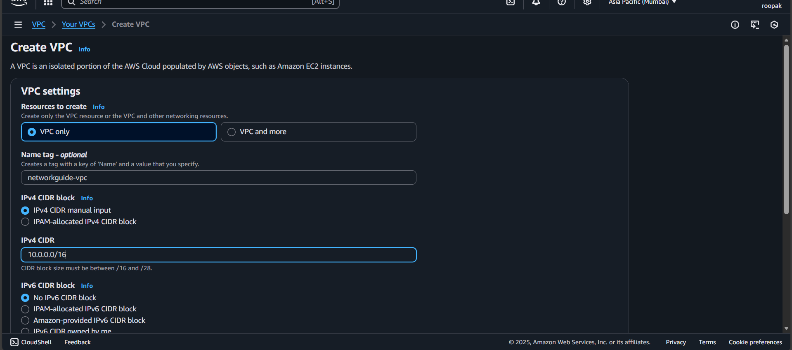
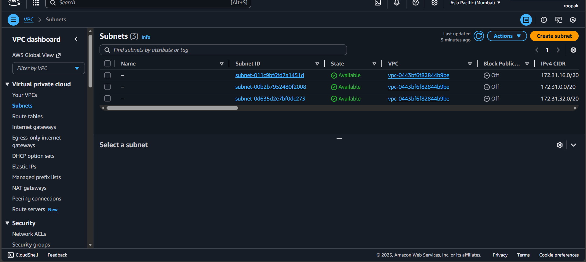
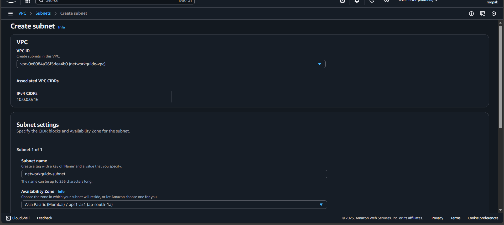
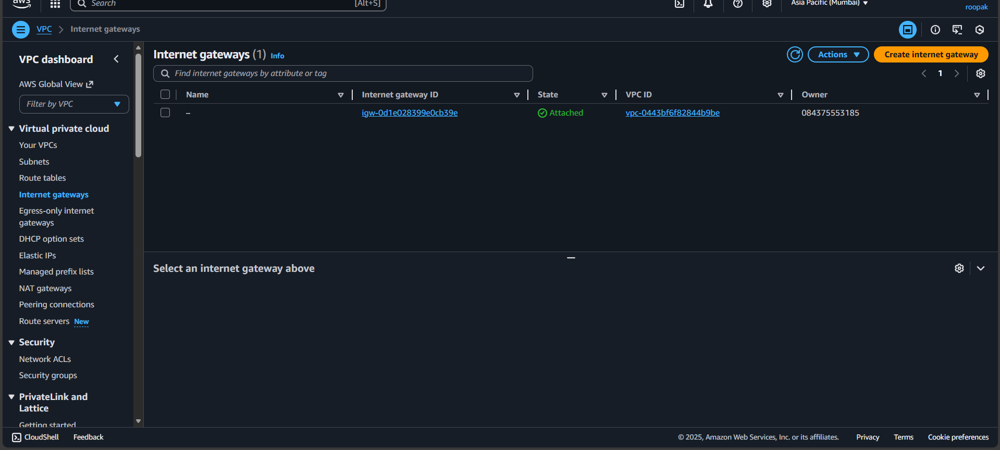
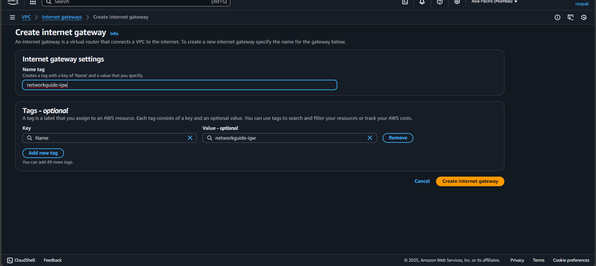
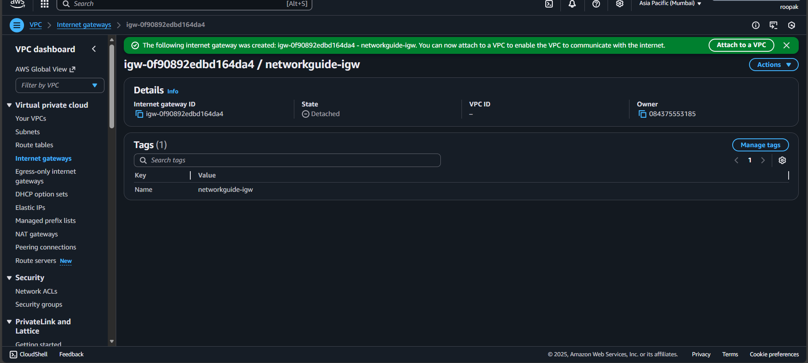

# VPC

# Aim

To set up a **Private Cloud in AWS**.

# Setting up a Private Cloud in AWS

Setting up a private cloud within AWS—also known as a **Virtual Private Cloud (VPC)**—involves creating a logically isolated virtual network where you can launch AWS resources. This gives full control over resource placement, connectivity, and security.

Amazon Virtual Private Cloud (Amazon VPC) allows you to configure your network and add resources like EC2 and RDS instances. You can also define how VPCs communicate across accounts, Availability Zones, or Regions.

---

# Procedure

## 1. Planning Your VPC

-   **Determine your needs:**  
    Define use cases, application requirements, and security/compliance needs.

-   **Plan IP address ranges:**  
    Choose appropriate CIDR blocks for the VPC and subnets.

-   **Select Availability Zones:**  
    Decide which AZs to deploy resources based on redundancy and performance.

-   **Plan internet connectivity:**  
    Determine if public internet access is needed.

-   **Define security:**  
    Plan Security Groups, Network ACLs, and access controls.

---

## 2. Creating Your VPC

1. Sign in to AWS Management Console and open the **VPC Dashboard**.
2. Choose **Create VPC**.
3. Configure VPC details:
    - Name
    - CIDR block
    - Availability Zones
    - Other required settings
4. Create subnets for different segments of your network.
5. Create route tables to manage internal and external routing.
6. Create security groups to control access.

---

## 3. Deploying Resources

-   **Launch EC2 instances:**  
    Create virtual machines within the VPC.

-   **Set up RDS instances:**  
    Deploy managed databases.

-   **Configure networking:**  
    Attach subnets, security groups, and route tables.

-   **Deploy other services:**  
    Use S3 for storage, Lambda for serverless processing, etc.

---

## 4. Managing and Monitoring

-   **Use AWS CloudWatch:**  
    Monitor performance and health.

-   **Configure logging and auditing:**  
    Use VPC Flow Logs, CloudTrail, and CloudWatch Logs.

-   **Implement security best practices:**  
    Review and update configurations regularly.

-   **Scale and adjust as needed:**  
    Modify infrastructure based on requirements.

---

# Snapshots

**Snapshot 1:** Create VPC  

**Snapshot 2:** Configuring Subnets

**Snapshot 3:** Configure Subnets

**Snapshot 4:** Setting Internet Gateway

**Snapshot 5:** Internet Gateway Setup  

**Snapshot 6:** Internet Gateway Attachment

---

# Result

Thus, a private cloud on AWS using VPC has been created, providing a dedicated and isolated network where resources can be managed securely and efficiently.
